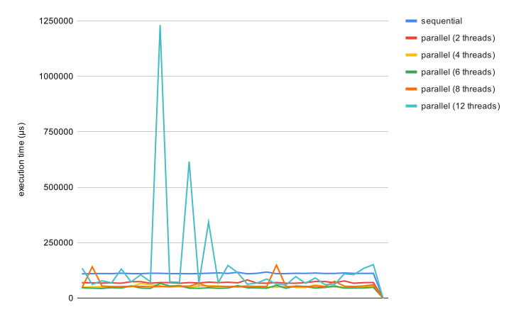

# High Performance Computing Project Report
**date**: *27/06/2022*</br>
**course code**: *CM0227*</br>
**reference professor**: *Claudio Lucchese*</br>
**authors**: *Volpe Davide (862989), Sello Stefano (864851)*</br>

## Introduction

[Slink](https://doi.org/10.1093/comjnl/16.1.30) is a single linkage clustering algorithm developed by [R. Sibson](https://academic.oup.com/comjnl/search-results?f_Authors=R.+Sibson) in 1973 in order to provide an efficient algorithm to cluster elements coming from huge datasets with the "single linkage" method. The algorithm is based on the so-called "pointer representation" of a [*dendrogram*](https://en.wikipedia.org/wiki/Dendrogram), which consists of two vectors $\pi$ and $\lambda$ that represent, respectively, the $id$ of the higher element of the cluster to which the element belongs and the $distance$ to the closest element of such cluster.

The aim of this project is to investigate the possibility of parallelization of such algorithm in order to optimize its execution times for large inputs. The kernel algorithm is developed using the `C++` language, but a convenience script written in `Python` is provided.

The whole source code can be found in the related [GitHub repository](https://github.com/westfox-5/slink).

## Code structure

At the top-level directory of the project there are:
* the `bootstrap.py` script, used to automate the compile/execute tasks;
* the `makefile`, which automates the compilation process;
* the `datasets` directory containing the `csv` files used to test the algorithm
* the `lib` directory to store external libraries
* the `src` directory containing all the source and heading files for the project. In particular, inside the latter there is the `slink_executors` directory which contains the core code responsible for the different execution modes of the algorithm.


### External Dependencies

The only library we rely on is [RapidCSV](https://github.com/d99kris/rapidcsv), a single-header library that provides parsing and easy access to data in a csv file.
We did not investigate the perfomances of this library since it is only used to load the input into our data structure. This fraction of execution must be executed sequentially, therefore we can assume it constant with respect to the input size.

## Bootstrap synopsis

The convenience script has been developed in order to provide a clear and simple user-experience over the program.

We used [Conda](https://docs.conda.io/en/latest/) to easily setup a portable execution environment.

``` shell
$> conda env create -f environment.yml
$> conda activate slink
```

Then you can run the script with:

```shell
(slink)$> python bootstrap.py

Usage: bootstrap.py [MODE] [MODE ARGS] [OPTIONS] [ARGS]
  MODE:
   -r --random <matrix dimension>            generate a distance matrix with random numbers
   -i --input <input file>                   compute the distance matrix for the specified file
  OPTIONS:
   -h --help                                 print this helper
   -v --verbose                              enable verbose mode
   -f --force                                force recreation of the distance matrix
   -n --num-threads <N>                      specify number of threads for the parallel execution
   -m --matrix-type <linear, col_major>      specify type of matrix to store data
   -t --file-type <dist, csv>                forces the execution with the specified file type
   -e --execution-type <0,..,3>                executes a specific execution policy (0=sequential, 1=parallel OMP, 2=parallel split, 3=parallel split OMP)
   -p --perf                                 enables execution with 'perf' tool
```

Some examples on how to use the script:
* `python bootstrap.py -v -r 500 -n 4 -e 0,1,2,3`
creates an input matrix of size 500x500 containing random distances and executes all the implementations  of the algorithm on this matrix with 4 threads.
* `python bootstrap.py -v -i datasets/imports-85.data -n 4 -m col_major -e 0,1`
runs the sequential and OMP implementations on the provided csv file with 4 threads and structuring the data in a column major way. Only half of the input is stored in this way.

## Implementations

### Serial

We started this project by developing the sequential implementation of the algorithm, based on the pseudo-code provided. This version will be the basis for our further analysis and parallel implementations, since it provides a base execution time and the vectors $\pi$ and $\lambda$.
A `check-value` function is computed on the results of execution in order to provide a fast way of proving correctness of the various implementations. We made the assumption that the value provided by the serial implementation is correct.

#### Performance analysis

All performance analysis are provided by using the `perf` command line tool. In particular, by using the flags `-p` or `--perf` in the bootstrap script, the execution of the algorithm will be wrapped with the `perf -d -r <x>` command, which executes the selected algorithm $x$ times. We fixed the value of $x$ to 30.
Here there are some measurements for a random distance matrix of 5000 elements:

    
```
 Performance counter stats for './slink dist ./5000.in linear 12 0' (30 runs):

          2,795.98 msec task-clock                #    0.999 CPUs utilized            ( +-  0.62% )
                61      context-switches          #    0.022 K/sec                    ( +- 30.58% )
                 1      cpu-migrations            #    0.000 K/sec                    ( +- 16.61% )
               801      page-faults               #    0.287 K/sec                    ( +-  5.86% )
    12,006,954,321      cycles                    #    4.294 GHz                      ( +-  0.61% )  (49.91%)
    27,274,298,965      instructions              #    2.27  insn per cycle           ( +-  0.02% )  (62.47%)
     5,803,899,146      branches                  # 2075.803 M/sec                    ( +-  0.02% )  (62.51%)
        21,746,477      branch-misses             #    0.37% of all branches          ( +-  4.74% )  (62.55%)
     7,020,332,896      L1-dcache-loads           # 2510.868 M/sec                    ( +-  0.02% )  (62.60%)
        32,957,969      L1-dcache-load-misses     #    0.47% of all L1-dcache accesses  ( +-  0.70% )  (62.58%)
        10,688,240      LLC-loads                 #    3.823 M/sec                    ( +-  0.81% )  (49.96%)
         1,612,549      LLC-load-misses           #   15.09% of all LL-cache accesses  ( +-  0.91% )  (49.90%)

            2.7978 +- 0.0174 seconds time elapsed  ( +-  0.62% )
```

### OpenMP

The next step we took was to include the [OpenMP](https://www.openmp.org/) API in the serial version of the algorithm. We immediately realized how thightly coupled were the iterations of the loop and how difficult it was to parallelize it.

The best configuration for the OMP directive is the one used in [src/slink_executors/parallel_omp.cpp](./src/slink_executors/parallel_omp.cpp). The outer loop could not be parallelized so we focused on the inner loops, specifically on the _update_ and _finalize_ loops. This configuration led to the best results in terms of execution times with respect to the serial implementation. Also, from a cache point of view, parallelizing the first inner loop has the benefit of reduce cache misses, since threads will access the same elements of the distance matrix in a short time range.

#### Performance analysis

The following graph compares the execution times between the serial and parallel versions of the algorithm on a input matrix of size 5000x5000. 

The tests are executed on a Intel(R) Core(TM) i7-8700 CPU @ 3.20GHz with 6 physical cores and 12 threads. The compiler is gcc version 10.2.1.




The obtained speedup is:

|                        | SpeedUp |
| ---------------------- | ------- |
| Parallel (2 Threads)   | 1,587   |
| Parallel (4 Threads)   | 2,151   |
| Parallel (6 Threads)   | 2,293   |
| Parallel (8 Threads)   | 1,859   |
| Parallel (12 Threads)  | 0,740   |

The parallel version runned with 12 threads clearly deteriorates the mean performances as we can notice from the three peaks of the light-blue line in the chart and the speedup, which is the only one less than 1.

The best speedup obtained is related to the execution with 6 threads. This is as expected since the CPU under test has 6 cores.

### Divide and Conquer

Next we focused on how to apply a _divide and conquer_ approach to this algorithm. The main idea is to partition the input and apply _Slink_ to each slice, but we faced serious issues at the merging process of two partial results.
We tried various different approaches on how to correctly merge two clusters represented in the form of two $\pi$ and $\lambda$ vectors.

Starting from the first (or left-most) cluster, we tried to adjust each node in this cluster considering distances with the nodes in the second (or right-most) cluster.
But after that we noticed that nodes in the second cluster needed to be finalized too, in particular the $\lambda$ vector of distances.
We developed an algorithm that, given a node _n_ and all nodes _i_ such that _$\pi$[i]=n_, finds the minimum distance of the node _i_ with any other node _j_ such that _$\pi$[j]=$\pi$[n]_. This seems complicated but essentialy is the linkage of two clusters (n and $\pi$[n]) with the minimum distance.
The distance at $\lambda$[n] is updated with such a minimum distance, if found.

We struggled to make it work, but without success, so we decided to keep this version as is and analyze the performances of it, knowing that the correctness is wrong.

#### Performance analysis

The merge process is extremely costly because it loops over all elements of the two input sets twice (in order to adjust distances and links). So it is inconvenient to use it, as also measurements show. As a matter of fact the mean execution times for such an algorithm are always way worst then the sequential algorithm, as shown in the following table:

|                        | Mean execution time (ms) |
| ---------------------- | ------------------------ |
| Parallel (2 Threads)   | 202                      |
| Parallel (4 Threads)   | 256                      |
| Parallel (6 Threads)   | 356                      |
| Parallel (8 Threads)   | 440                      |

The mean execution time decreases as we increase the concurrency degree of the execution. This behaviour is due to the fact that more threads imply more merge operations, that are costly. So this solution is bad and should be avoided. However we were not able to find a more efficient merging algorithm or a more convenient way to split the algorithm into concurrent tasks.

### Divide and Conquer - OMP

Finally we tried to apply [OpenMP](https://www.openmp.org/) to the _Divide and Conquer_ algorithm, in order to look for a way to improve performances (despite the fact that the algorithm is not completely correct). The results were not gratifying: in this case the performances degraded consistently.

|                        | Mean execution time (ms) |
| ---------------------- | ------------------------ |
| Parallel (2 Threads)   | 14639                    |
| Parallel (4 Threads)   | 13937                    |
| Parallel (6 Threads)   | 13413                    |
| Parallel (8 Threads)   | 13791                    |

This is the worst result we obtained so far.

## Conclusions
Due to the implicit sequential nature of the algorithm and the lack of literature about the topic the best result we could achieve is also the more obvious one: parallelizing the _update_ and _finalize_ inner loops that do not have any significant data dependency inside them. We were not able to find a way to parallelyze the inner loop of _update_, nor the outer loop, due to the data dependencies present between iterations. Also, the level of parallelization we achieved is not particullary good, since the algorithm is not scalable: the enlargement of the number of concurrent threads does not increase the performances linearly.